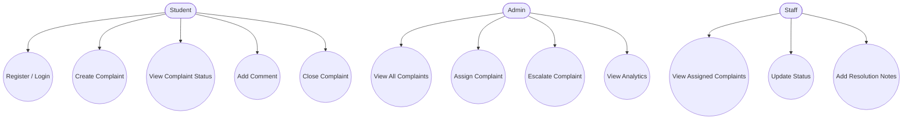

```mermaid
flowchart TD

Student([Student])
Admin([Admin])
Staff([Staff])

RegisterLogin((Register / Login))
CreateComplaint((Create Complaint))
ViewStatus((View Complaint Status))
AddComment((Add Comment))
CloseComplaint((Close Complaint))

ViewAll((View All Complaints))
AssignComplaint((Assign Complaint))
EscalateComplaint((Escalate Complaint))
ViewAnalytics((View Analytics))

ViewAssigned((View Assigned Complaints))
UpdateStatus((Update Status))
AddResolution((Add Resolution Notes))

Student --> RegisterLogin
Student --> CreateComplaint
Student --> ViewStatus
Student --> AddComment
Student --> CloseComplaint

Admin --> ViewAll
Admin --> AssignComplaint
Admin --> EscalateComplaint
Admin --> ViewAnalytics

Staff --> ViewAssigned
Staff --> UpdateStatus
Staff --> AddResolution
```